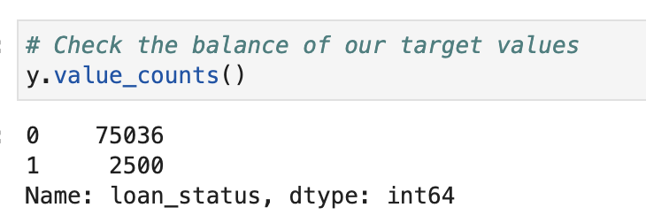
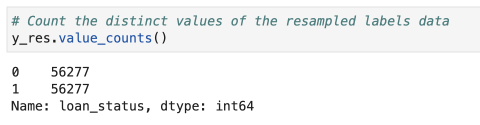
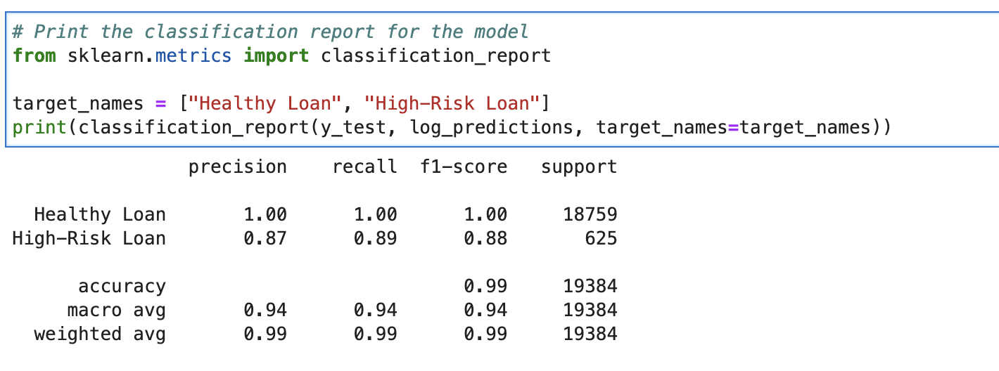
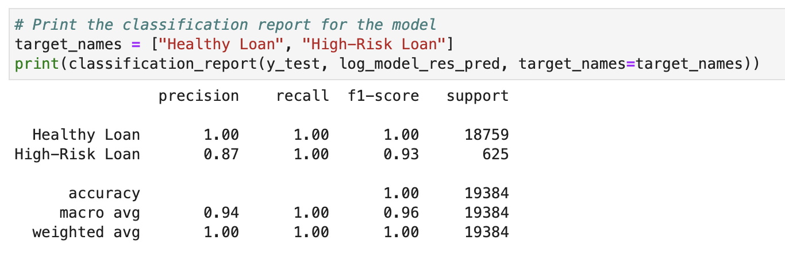

## Overview of the Analysis

* I used various techniques to train and evaluate a model based on loan risk using a dataset of historical lending activity from a peer-to-peer lending services company. Then I built a model that can identify the creditworthiness of borrowers. The dataset provided various features, such as loan size, interest rate, borrower income, debt to income ratio, number of accounts, derogatory marks, total debt, and loan status. A healthy loan has a loan status of 0 and a high-risk loan has a loan status of 1. These would all be used to predict the loan status.

* When checking the value_counts for y, it was shown that the original logistic regression model was extremely unbalanced. There were 75,036 instances of healthy loans vs 2,500 instances of high risk loans. 
 
 
* *A summary of the original logistic regression can be found in the results section* 

* To balance the data, I used the random oversampler model with a random_state parameter of 1. After this, the data had 56,277 for both healthy loan and high risk loan status.
 
 
* After this, the model was retrained. 
* *A summary of the balanced logistic regression can be found in the results section* 

## Results
* The accuracy measures the number of correct predictions compared to the total number of predictions made.
* The precision shows the number of true postives predicted divided by the total number of positive predictions (both true positives and false positives).
* The recall score is the true positive rate. So, it's true positives divided by the sum oftrue positives and false negatives. 

* #### Machine Learning Model 1:
  * Accuracy: 0.99
  * Precision Healthy Loan: 1.00
  * Precision High-Risk Loan: 0.87
  * Recall score Healthy Loan: 1.00
  * Recall score High-Risk Loan: 0.89
  

* #### Machine Learning Model 2:
  * Accuracy: 1.00
  * Precision Healthy Loan: 1.00
  * Precision High-Risk Loan: 0.87
  * Recall score Healthy Loan: 1.00
  * Recall score High-Risk Loan: 1.00
  
 
## Summary
* The original logistic regression model does a fairly good job at predicting a healthy loan and high-risk loan. The precision score for the healthy loan is 1.00, as are the recall and f-1 score. This means there is perfect precision. It makes sense that these values are so high as there is more data available for the healthy risk loan. The precision for the high risk loan is 0.87, the recall is a 0.89, and the f1-score is 0.88. Although this is lower than the healthy risk loan, it is still pretty good. The data set was unbalanced so this is probably why the values are lower. Overall, the accuracy was high, with an f1-score of 0.99. 
* The model performed better after being balanced. The healthy loan scores remained the same. However, the recall and f1-score for the high risk loan increased to 1.00 and 0.93, respectively. The accuracy f1-score also increased to 1.00.
* Although the balanced model was only 0.01 more accurate than the original model, I would recommend using it, especially since it's for predicting whether or not someone can get a loan. You don't want to give a loan to someone who will default on it since the financial institution will lose money. 
